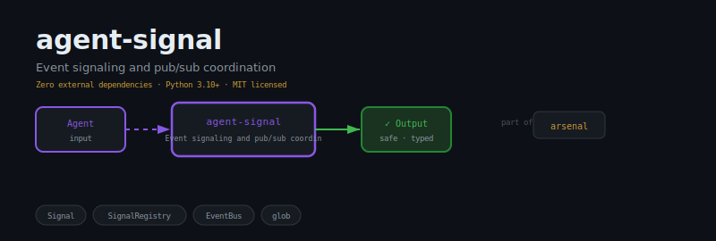
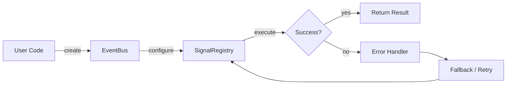
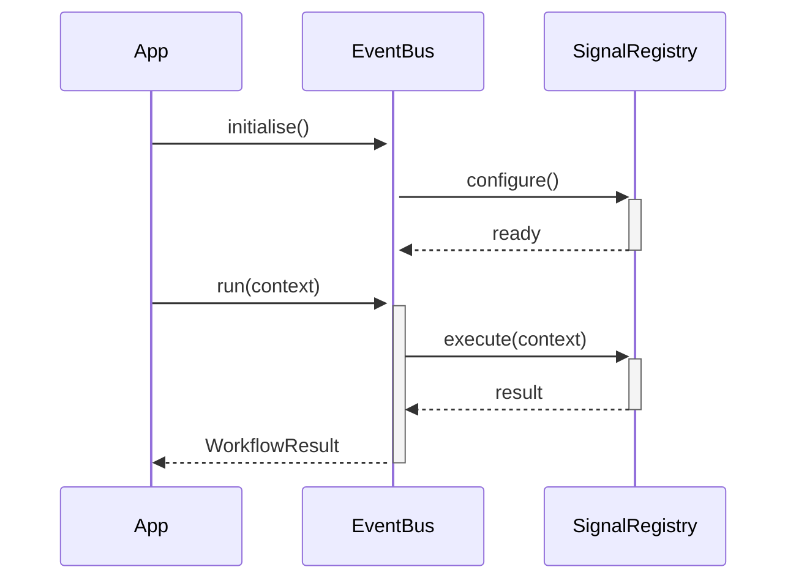

<div align="center">

</div>

# agent-signal

**Event signaling and pub/sub for agent coordination**

[](https://pypi.org/project/agent-signal/) [](https://python.org) [](LICENSE) [](#)

---

## The Problem

Without a signal system, agents poll for state changes — wasting tokens, adding latency, and missing events that happen between polls. Push beats pull; events beat polling.

## Installation

```bash
pip install agent-signal
```

## Quick Start

```python
from agent_signal import EventBus, SignalRegistry

# Initialise
instance = EventBus(name="my_agent")

# Use
# see API reference below
print(result)
```

## API Reference

### `EventBus`

```python
class EventBus:
    """Broadcast event bus. Topics support glob patterns (e.g. 'agent.*')."""
    def __init__(self) -> None:
    def subscribe(self, topic: str, handler: Callable) -> None:
        """Subscribe handler to topic. Topic may be a glob pattern."""
    def unsubscribe(self, topic: str, handler: Callable) -> None:
        """Unsubscribe handler from topic. Silent no-op if not found."""
    def publish(self, topic: str, data: dict | None = None) -> None:
        """Publish event to all handlers whose subscription pattern matches topic."""
```

### `SignalRegistry`

```python
class SignalRegistry:
    """Central registry of named signals. Thread-safe."""
    def __init__(self) -> None:
    def signal(self, name: str) -> Signal:
        """Return existing signal or create a new one."""
    def emit(self, name: str, *args: Any, **kwargs: Any) -> None:
        """Emit a named signal. No-op if signal not registered."""
    def list_signals(self) -> list[str]:
        """Return sorted list of registered signal names."""
```


## How It Works

### Flow



### Sequence



## Philosophy

> *Nāda Brahman* — the primordial sound — is the first signal; all event systems echo this original pulse.

---

*Part of the [arsenal](https://github.com/darshjme/arsenal) — production stack for LLM agents.*

*Built by [Darshankumar Joshi](https://github.com/darshjme), Gujarat, India.*
